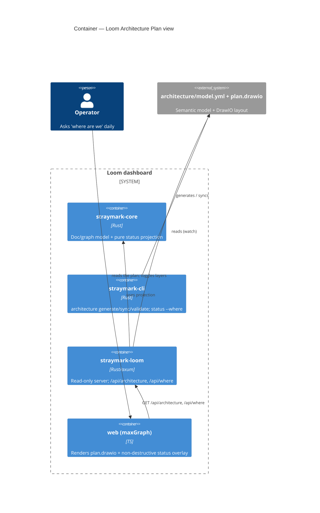

# ADR: Loom Architecture Plan — model format, status projection, and generator

## Status

draft

**Note**: This document was created by an AI agent and requires human review.

> **Immutability Rule**: Once this ADR reaches `accepted`, it MUST NOT be modified; supersede
> it with a new ADR instead.

## Context

Loom (the experimental Loom dashboard — see `ADR-2026-06-02-001` for stack/distribution) was
initially scoped as a knowledge-graph view of *documents*. Operator feedback reframed it:
for large projects (reference: Sentinel), the operator's daily question is *"where are we?"*
against the **system's implementation map** — the architecture, not the document web. Borrowing
from civil engineering / BIM (one model, many views; layers that light up to show status),
Loom gains a second surface: the **Architecture Plan view** (Spec
`experimento/specs/002-architecture-plan/spec.md`).

This ADR records the decisions specific to that surface: how the architecture is **modeled**,
how the **"you are here" status overlay** is computed, what **editable format** carries the
human-authored layout, and how a **generator** seeds it. Exploration established the key
enabling facts: (a) StrayMark has no `component` concept — it maps documents to **files**
(Charter "Files to modify" via `charter_files::parse_files_to_modify`, AILOG "Modified Files",
`api_changes`); (b) Charter status (`declared`/`in-progress`/`closed`) and declared-vs-modified
**drift** are already computed; (c) ADRs already embed structured **C4 mermaid** blocks and
**"Affected Components"** tables; (d) the `.straymark/` stages 00–09 form a canonical layering;
(e) `metrics_engine`, TDE docs, and `analyze declared-vs-wired` provide further state.

## Decision

1. **Model the architecture as two linked artifacts (BIM "model vs. drawing" split):**
   - **`architecture/model.yml`** — the semantic model: `layers`, and `components` where a
     component is a named group of **file globs** in a layer, with optional `links` (edges).
     Source of truth for *meaning*.
   - **`architecture/plan.drawio`** — **DrawIO (mxGraph XML)**: the source of truth for
     *position/shape/routing*, hand-editable. Each cell carries a `straymark_component_id`
     custom attribute joining it to a `model.yml` component.
   Adopter home: `.straymark/architecture/`. (This source repo dogfoods at
   `experimento/architecture/` since it has no root `.straymark/` install.)

2. **Compute the "you are here" status projection by matching governance-derived file sets
   against component globs** — a **pure function** in `straymark-core`, reusing
   `charter_files::parse_files_to_modify` (active charter declared files → `active`), `charter
   drift` (declared∩modified → `in-progress`), closed charters/AILOGs (`implemented`), TDE
   (`has-debt`), `analyze declared-vs-wired` (`wiring-gap`), and "files on disk, no doc"
   (`uncharted`). Because it is pure and in core, the CLI can also answer it textually
   (`/api/where` and a future `straymark status --where`).

3. **Render `plan.drawio` in the browser with maxGraph** (`@maxgraph/core`, the maintained
   successor to mxGraph, the engine DrawIO is built on), applying status as **non-destructive
   cell-style overrides** keyed on `straymark_component_id`. Loom never rewrites geometry.

4. **Seed the model with a hybrid generator** (`straymark architecture generate|sync|
   validate`, a CLI command since it writes files): propose components from the **codebase
   directory structure** (reusing the `analyze` file walker) **enriched** by mining the **C4
   mermaid blocks** and **"Affected Components"** tables in existing ADRs; auto-lay-out a first
   `plan.drawio` (elk/dagre). `sync` appends suggestions without clobbering human edits;
   `validate` reports integrity (undrawn / unmodeled / empty components).

5. **MVP = the 2D plan with the overlay + layer toggle** (show/hide layers 00–09 — the 2D
   analog of peeling floors). The **axonometric/BIM exploded view is the north star**, post-MVP.

6. **Require no new frontmatter.** The default doc→component mapping is glob-based; an optional
   `component:` field is explicitly deferred (no Framework change for the MVP).

## Alternatives Considered

### 1. Single DrawIO file as the only source of truth (globs as cell attributes)
- **Pros**: one artifact; everything edited in DrawIO.
- **Cons**: maintaining semantic globs/links inside drawing XML attributes is awkward and
  error-prone; mixing model and drawing loses the "many views" property.
- **Why not**: the model/drawing split (BIM) lets the same model drive the 2D plan, the
  knowledge-graph cross-links, and the future axonometric view; semantics belong in YAML.

### 2. Loom-native canvas owning the layout (DrawIO only as export)
- **Pros**: native live status, full control, drag-and-drop in-app.
- **Cons**: much more to build for the MVP; loses real DrawIO as the daily editing driver the
  operator asked for ("libertad para reeditar las rutas").
- **Why not**: DrawIO round-trip via maxGraph delivers the editing freedom at far lower cost;
  a native canvas can come later without changing the model.

### 3. Mermaid C4 (auto-generated) as the plan
- **Pros**: text, diffable, already used in StrayMark ADRs.
- **Cons**: **auto-layout only** — the operator cannot freely arrange, and layout churns on
  every change, defeating "the map you recognize each morning."
- **Why not**: a stable, human-arranged layout is the whole point of the "you are here" map.
  (Mermaid C4 is still mined by the generator as an *input*.)

### 4. New `component:` frontmatter field for doc→component mapping
- **Pros**: explicit, unambiguous mapping.
- **Cons**: touches the Framework (a field shipped to all adopters) and demands per-document
  annotation discipline.
- **Why not (for MVP)**: globs map docs→components with zero framework change and zero adopter
  annotation; the field is deferred as an optional future enhancement.

### 5. AST/dependency-graph extraction of components
- **Pros**: precise, automatic component boundaries.
- **Cons**: language-specific and fragile; StrayMark is deliberately language-agnostic.
- **Why not**: globs are language-agnostic and align with the existing `declared_vs_wired`
  glob profiles.

## Consequences

### Positive
- The architecture plan becomes a **live projection of governance state** — "where are we" is
  computed from Charters/AILOGs/TDE, not hand-maintained.
- DrawIO round-trip gives operators full layout freedom; Loom only overlays.
- One model drives multiple views (plan now, axonometric later, KG cross-links) — BIM-style.
- Zero Framework change and zero new adopter annotation for the MVP (glob mapping).

### Negative
- Two linked artifacts (`model.yml` + `plan.drawio`) to keep in sync — mitigated by
  `generate/sync/validate` and integrity signals.
- maxGraph/mxGraph XML round-trip fidelity is a real engineering risk (custom-attribute
  preservation, style override without geometry loss).
- Glob mapping can be coarse; components with no files (purely conceptual) need the optional
  `docs:` escape hatch in `model.yml`.

### Neutral
- A new CLI command surface (`straymark architecture …`) joins the CLI.

### Quality Impact Assessment

| Quality Characteristic (ISO 25010:2023) | Impact | Description |
|-----------------------------------------|--------|-------------|
| Functional Suitability | + | Answers the operator's core daily question ("where are we") visually and textually |
| Interaction Capability | + | Self-explanatory blueprint + status; lowers comprehension cost for large projects |
| Compatibility | + | Reuses existing charter/drift/metrics computation; DrawIO is a portable interchange format |
| Maintainability | ~ | Two linked artifacts and a round-trip add surface; mitigated by validate/sync |
| Portability | + | Glob-based projection is language-agnostic |
| Security | ~ | No new surface beyond Spec 001's loopback server (generation is a separate CLI action) |

## Affected Components

| Component | Type of Change | Impact |
|-----------|----------------|--------|
| `straymark-core` (status projection) | New (pure function) | High |
| `straymark-cli` (`architecture generate/sync/validate`, `status --where`) | New subcommands | Medium |
| `straymark-loom` (architecture view) | New (maxGraph render + overlay) | High |
| `experimento/web` (maxGraph integration) | New | Medium |
| `.straymark/architecture/` convention | New artifacts | Low |

## Implementation Plan

1. A1 — `straymark-core` status projection (pure) + `straymark architecture generate|sync|
   validate` + `/api/where` (ships as a `cli-` increment; immediate textual value).
2. A2 — Architecture Plan view in Loom (maxGraph render + overlay + layer toggle + panels +
   cross-view linking) in a `loom-0.x` release.
3. A3 — Axonometric/BIM exploded view (north star, post-MVP).

(Detail in `experimento/specs/002-architecture-plan/spec.md` §12 and the shared
`experimento/specs/001-loom-server/plan.md`.)

## Success Metrics

- After A1, `straymark architecture generate` yields an editable `model.yml`+`plan.drawio`,
  and the textual "where are we" matches `charter list --status in-progress` + `drift`.
- After A2, the rendered plan lights up the active Charter's components; a DrawIO re-layout
  survives with the overlay re-applied (round-trip lossless).

## Validation Criteria

| Metric | Target Value | Measurement Method | Timeline |
|--------|-------------|-------------------|----------|
| DrawIO round-trip fidelity | geometry lossless | move/reroute in DrawIO, reload, diff geometry | A2 |
| "you are here" correctness | matches CLI | diff overlay vs `charter list`/`drift` | A2 |
| Generator usefulness | < manual-from-scratch | seed a real repo, count manual edits needed | A1 |

## Architecture Diagram

## References

- `experimento/specs/002-architecture-plan/spec.md`
- `docs/decisions/ADR-2026-06-02-001-loom-stack.md` (stack/distribution)
- `experimento/CHARTER-01-loom-server.md`
- Reused CLI code: `cli/src/charter_files.rs`, `cli/src/charter.rs`,
  `cli/src/commands/charter/drift.rs`, `cli/src/metrics_engine.rs`,
  `cli/src/analysis_engine.rs`, `cli/src/commands/analyze_declared_vs_wired.rs`,
  `dist/.straymark/00-governance/C4-DIAGRAM-GUIDE.md`, ADR `## Affected Components` table
- Inspiration: the Sentinel architecture map (DrawIO); BIM axonometric exploded views

---

## Revision History

| Date | Author | Change |
|------|--------|--------|
| 2026-06-02 | claude-opus-4-8-1m | Initial creation (draft, pending human review) |

<!-- Template: StrayMark | https://strangedays.tech -->
